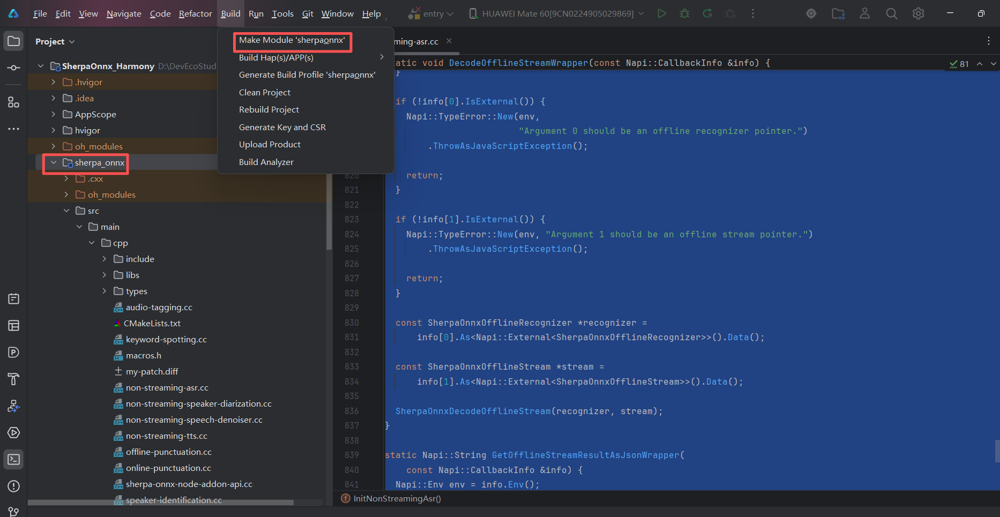

# HarmonyOS NEXT Sherpa-ONNX Engine (Pure Harmony)

专为 HarmonyOS NEXT (纯血鸿蒙) 环境深度定制与交叉编译的次世代 Sherpa-ONNX 语音识别核心库。

## 🚀 架构概览

## 核心技术价值
* **纯血鸿蒙原生适配**：完整打通底层 C++ 核心与 ArkTS 的 NAPI 桥接层，非兼容模式，原生瞬时响应。
* **开箱即用**：彻底解决国内环境下鸿蒙交叉编译底层 C++ 库（如 node_addon_api 依赖及 CMake 配置）的繁琐门槛。
* **高可拓展性**：提供标准、纯净的 HAR 库骨架，赋能开发者快速构建鸿蒙端侧的语音交互应用。

---

## 🌟 体验繁星不语输入法
本项目核心驱动了【繁星不语输入法】，欢迎前往华为应用市场体验完整功能：
[**点击此处前往华为应用市场下载【繁星不语输入法】**](https://appgallery.huawei.com/app/detail?id=com.fanxing.voice&channelId=SHARE&source=appshare)

---

## 如何集成 (Integration)

1. **获取完整工程**：
   请克隆或下载本仓库的**完整代码**（包含全局配置），使用 DevEco Studio 打开项目根目录。

2. **编译模块**：
   在 DevEco Studio 中选中 `sherpa_onnx` 模块，执行 `Build -> Make Module 'sherpa_onnx'`。
   *(注：首次编译 CMake 会自动拉取底层依赖，请确保网络通畅或配置好代理)*

3. **引用库文件**：
   获取编译产物 `sherpa_onnx.har`（路径：`sherpa_onnx/build/default/outputs/default/`），放置于目标工程的 `libs/` 目录下。

4. **配置依赖**：
   在目标项目的 `oh-package.json5` 中声明：
   
       "dependencies": {
         "sherpa_onnx": "file:./libs/sherpa_onnx.har"
       }

5. **初始化引擎**：
   通过 NAPI 接口构造 `OnlineRecognizer` 或 `OfflineRecognizer`，传入沙盒中的模型路径完成引擎异步点火。

## 许可证 (License)
本项目采用 MIT 协议开源。这意味着您可以免费在个人或商业项目中使用本引擎，但请在项目代码中保留原作者的版权声明。
